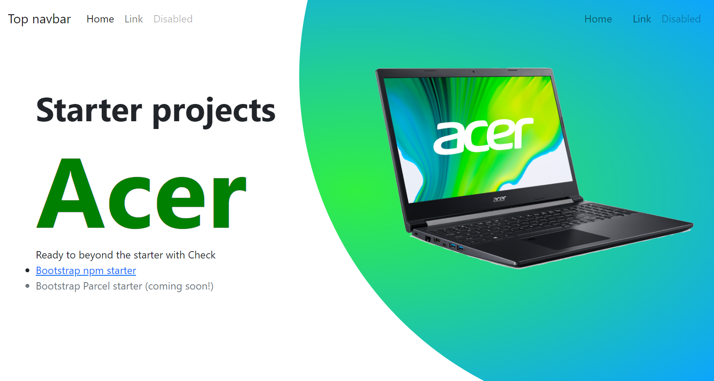

# Acerweb

This project was generated with [Angular CLI](https://github.com/angular/angular-cli) version 13.0.1.

## Con Bootstrapö 5.1 
* app.component.html
 ```
<app-nav></app-nav>
<section class="main">


</section>
<div class="row">
  <div class="col-md-6 p-5">
    <h2 style="font-size: 3.2em;">Starter projects <span
        style="color:green;font-size: 3em;font-weight:700px; "> Acer </span></h2>
    <p>Ready to beyond the starter with Check </p>
    <ul class="icon-list">
      <li><a href="https://github.com/twbs/bootstrap-npm-starter" rel="noopener" target="_blank">Bootstrap npm
          starter</a></li>
      <li class="text-muted">Bootstrap Parcel starter (coming soon!)</li>
    </ul>
  </div>

  <div class="col-md-6">

    
  </div>
</div>
 ```
## Development server

Run `ng serve` for a dev server. Navigate to `http://localhost:4200/`. The app will automatically reload if you change any of the source files.

## Code scaffolding

Run `ng generate component component-name` to generate a new component. You can also use `ng generate directive|pipe|service|class|guard|interface|enum|module`.

## Build

Run `ng build` to build the project. The build artifacts will be stored in the `dist/` directory.

## Running unit tests

Run `ng test` to execute the unit tests via [Karma](https://karma-runner.github.io).

## Running end-to-end tests

Run `ng e2e` to execute the end-to-end tests via a platform of your choice. To use this command, you need to first add a package that implements end-to-end testing capabilities.

## Further help

To get more help on the Angular CLI use `ng help` or go check out the [Angular CLI Overview and Command Reference](https://angular.io/cli) page.
